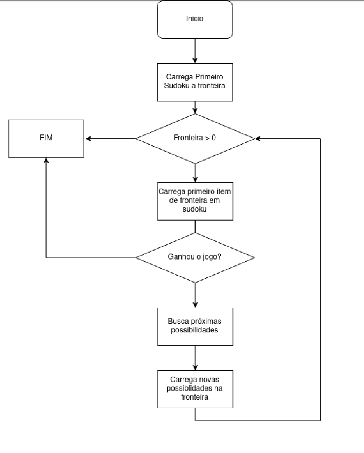

# Brute-Force Search VS Heuristic Search Algorithms Comparison


## Link to presentation

https://www.youtube.com/watch?v=B5aJgfDSzrs


## How to run

```python
python main.py
```


## Algorithm




## Results


